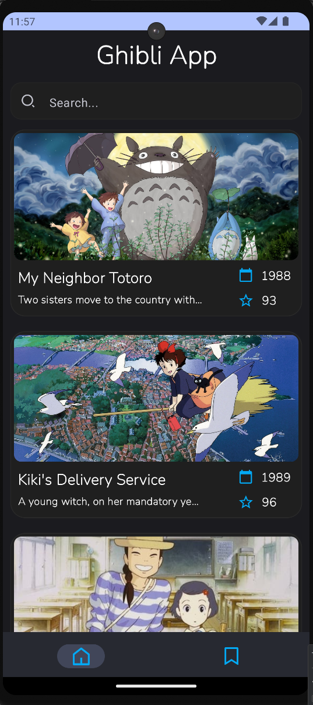
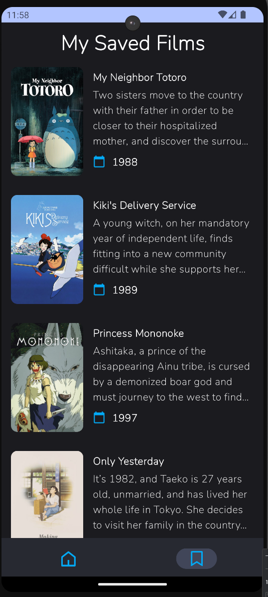
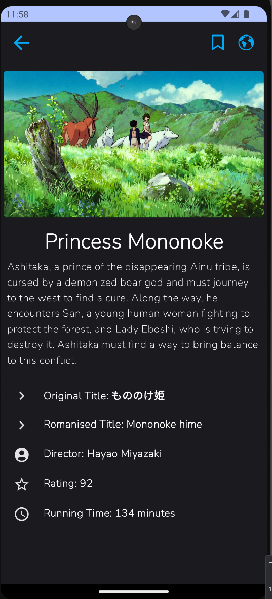

<!-- PROJECT LOGO -->

 

  <h3 align="center">Ghibli App</h3>

  

    An awesome app to stay up to date on studio ghibli movies. :smile:
     
     
  

## About The Project

This application allows you to explore and discover movies from the famous Ghibli Studio. With an intuitive interface and useful features, you can browse the list of movies, search for your favorites, view details about each one, and save them to your personal library.

## Features:

* Movie exploration: Explore the complete list of Ghibli Studio movies.
* Smart search: Easily find movies using the search feature.
* Personal library: Save your favorite movies to your own personal library for later viewing.
* Immersive experience: Enjoy an engaging visual experience with high-quality images and a modern user interface.

## Technologies Used:

This project uses modern Android development technologies to create an efficient and user-friendly application for exploring Studio Ghibli movies.

* Kotlin
* Jetpack Compose
* Dagger Hilt
* Coroutines
* Room Database
* Retrofit
* Clean Architecture & MVVM

## ScreenShots

  
